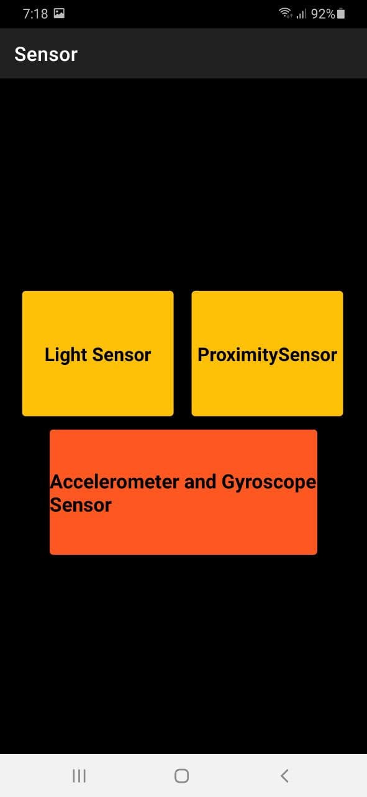
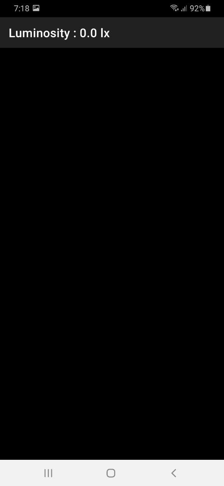
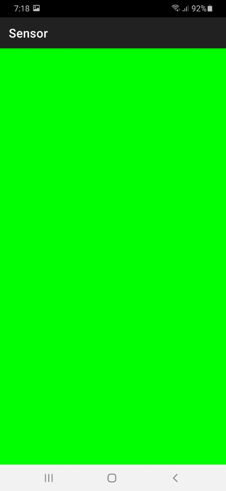
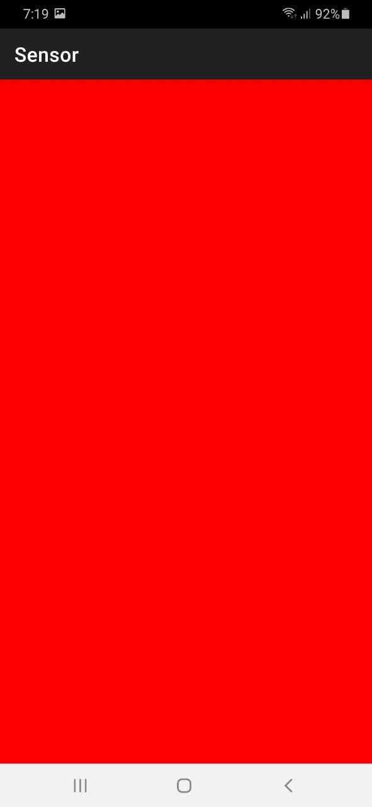
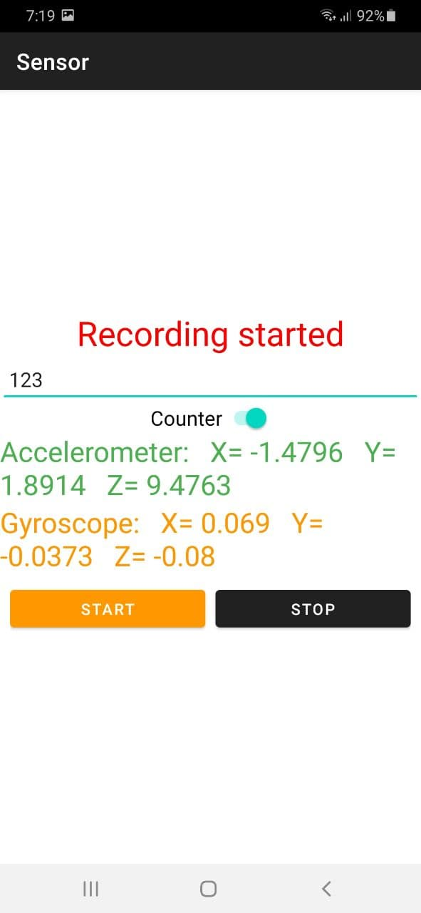
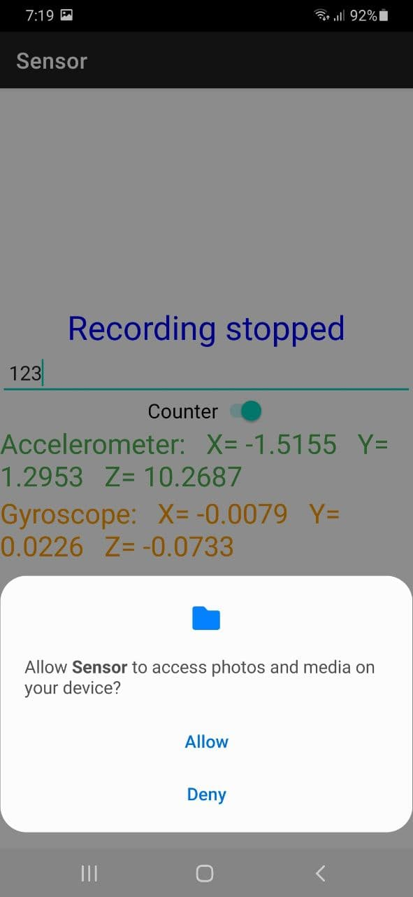
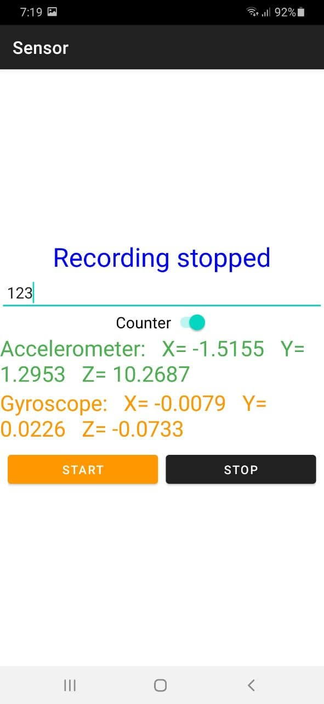

# Android-Sensor
This app main feature the values from light sensor, proximity sensor, accelerometer, and gyroscope, and shows the latest value .

# Home Page
 

# Light sensor
The light sensor is a passive devices that convert this “light energy” whether visible or in the infra-red parts of the spectrum into an electrical signal output.

 

# Proximity sensor
The proximity sensor detects when a user is holding the phone near their face during a call and turns off the display to prevent keypad presses and battery consumption from the display.

   

# Accelerometer And Gyroscope
The typical two-axis accelerometer gives users a direction of gravity in an aircraft, smartphone, car or other device. In comparison, a gyroscope is intended to determine an angular position based on the principle of rigidity of space.

     
